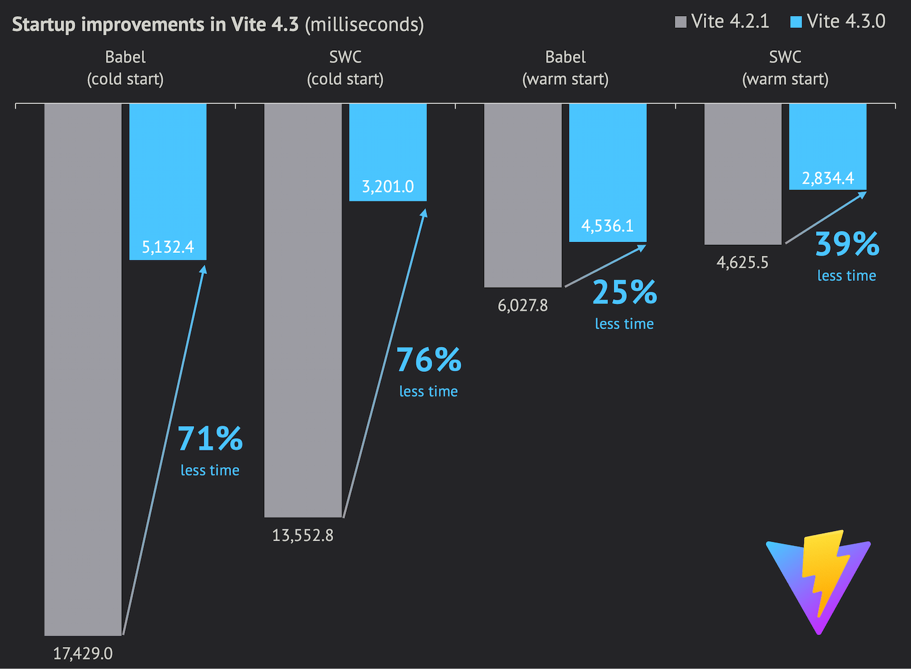
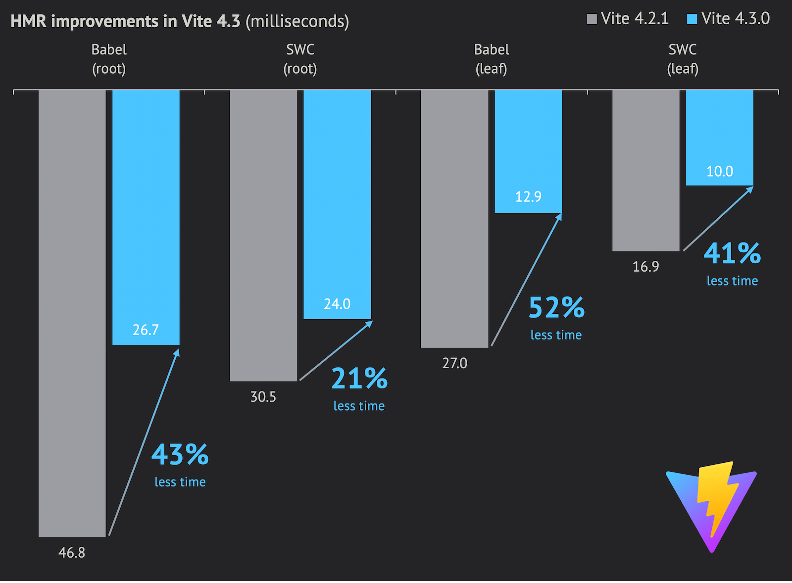

- 更新 vite 到 4.3 版本

## Vite 4.3 is out!

- 本次迭代中，我们专注于改善开发服务器的性能。我们优化了解析逻辑，改进了热路径，并实现了更智能的缓存，用于查找 package.json、TS 配置文件和解析的 URL 等。

- 你可以在 Vite 的贡献者之一的博客文章中详细了解本次性能工作：[How we made Vite 4.3 faaaaster 🚀](https://sun0day.github.io/blog/vite/why-vite4_3-is-faster.html)。

- 与 Vite 4.2 相比，这次迭代在各方面都取得了速度提升。

- 以下是 [sapphi-red/performance-compare](https://github.com/sapphi-red/performance-compare) 测试结果，该测试用例包含 1000 个 React 组件，在冷启动和热启动的情况下测试开发服务器的启动时间以及根组件和叶子组件的 HMR 时间：

| Vite (babel) | Vite 4.2  | Vite 4.3 | 改进   |
| ------------ | --------- | -------- | ------ |
| 开发冷启动   | 17249.0ms | 5132.4ms | -70.2% |
| 开发热启动   | 6027.8ms  | 4536.1ms | -24.7% |
| 根 HMR       | 46.8ms    | 26.7ms   | -42.9% |
| 子 HMR       | 27.0ms    | 12.9ms   | -52.2% |

| Vite (swc) | Vite 4.2  | Vite 4.3 | 改进   |
| ---------- | --------- | -------- | ------ |
| 开发冷启动 | 13552.5ms | 3201.0ms | -76.4% |
| 开发热启动 | 4625.5ms  | 2834.4ms | -38.7% |
| 根 HMR     | 30.5ms    | 24.0ms   | -21.3% |
| 子 HMR     | 16.9ms    | 10.0ms   | -40.8% |

- 你可以在[这里](https://gist.github.com/sapphi-red/25be97327ee64a3c1dce793444afdf6e)阅读有关基准测试的更多信息。本次性能测试的规格和版本如下：

- CPU：Ryzen 9 5900X，内存：DDR4-3600 32GB，固态硬盘：WD Blue SN550 NVME SSD
  Windows 10 Pro 21H2 19044.2846
  Node.js 18.16.0
- Vite 和 React 插件版本
  - Vite 4.2（babel）：Vite 4.2.1 + plugin-react 3.1.0
  - Vite 4.3（babel）：Vite 4.3.0 + plugin-react 4.0.0-beta.1
  - Vite 4.2（swc）：Vite 4.2.1 + plugin-react-swc 3.2.0
  - Vite 4.3（swc）：Vite 4.3.0 + plugin-react-swc 3.3.0
- 早期采用者在测试 Vite 4.3 beta 时还报告了实际应用程序的 1.5 倍至 2 倍的开发启动时间改进。
