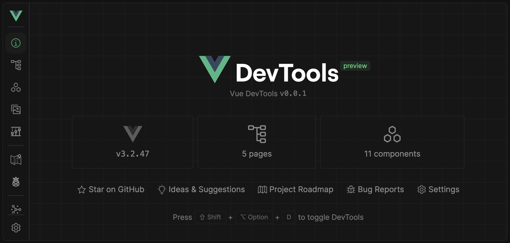
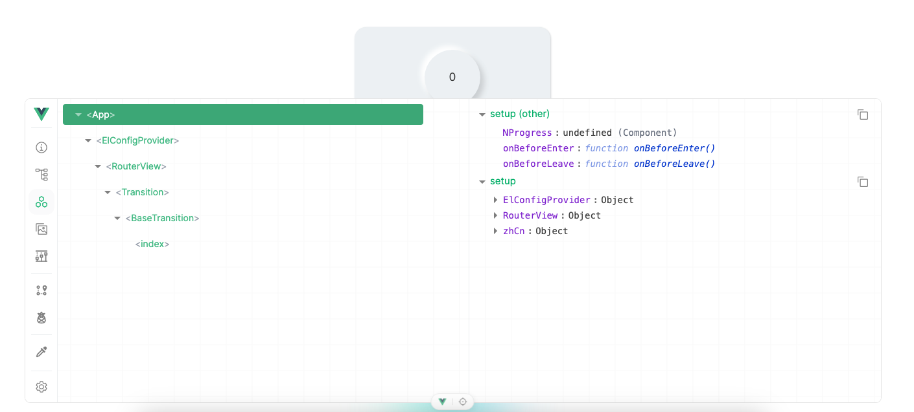
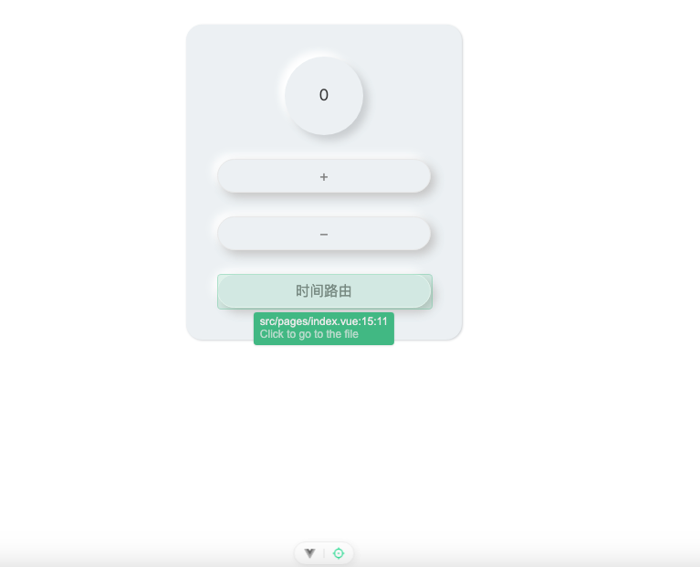

# Vue3 模板 添加新调试工具库

- [vite-plugin-vue-devtools](https://github.com/webfansplz/vite-plugin-vue-devtools)：是一个旨在增强 Vue 开发人员体验的 Vite 插件。
- 这个工具主要是在开发环境下进行调试用的，基本可以替代 `vue-devtool`
  
  
- 左边的 vue 图标点击就可以打开调试面板，包括组件、路由、状态等信息
  
  
- 右边的定位突变点击就可以选择页面上的元素，点击元素及会打开编辑器中对应的代码处
