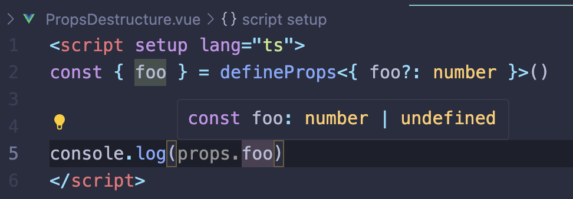

# 宣布 Vue 3.5 版发布

今天我们很高兴地宣布 Vue 3.5 版“天元突破红莲螺岩”正式发布！

这一小版本发布没有破坏性更改，包括内部改进和一些有用的新特性。我们将在这篇博客中介绍一些亮点 - 详细的更改和新特性请查阅 GitHub 上的完整[变更日志](https://github.com/vuejs/core/blob/main/CHANGELOG.md)。

## 响应式系统优化

在 3.5 版本中，Vue 的响应式系统经历了另一轮主要重构，实现了更好的性能和显著改进的内存使用（减少了 56%），没有行为上的变化。这次重构还解决了 SSR 中计算属性悬挂导致的过期计算值和内存问题。

此外，3.5 版本还优化了对大型深层响应式数组的响应式跟踪，使得某些操作速度提高了多达 10 倍。

## 响应式属性解构

响应式属性解构在 3.5 版本中已稳定。此功能现默认启用，`<script setup>` 中从 defineProps 调用中解构的变量现在是响应式的。值得注意的是，这个功能通过利用 JavaScript 的原生默认值语法，显著简化了具有默认值的属性声明：

**改进前**

```ts
const props = withDefaults(
  defineProps<{
    count?: number
    msg?: string
  }>(),
  {
    count: 0,
    msg: "hello",
  }
)
```

**改进后**

```ts
const { count = 0, msg = "hello" } = defineProps<{
  count?: number
  message?: string
}>()
```

访问解构变量（例如 count）会自动编译成 props.count，因此它们在访问时会被跟踪。与 props.count 类似，观察解构的属性变量或将其传递给组合函数时，需要将其包裹在一个 getter 中：

```js
watch(count /* ... */)
//    ^ 编译时错误

watch(() => count /* ... */)
//    ^ 包裹在 getter 中，按预期工作

// 组合函数应使用 `toValue()` 规范化输入
useDynamicCount(() => count)
```

对于那些希望更好地区分解构的属性和普通变量的开发者，@vue/language-tools 2.1 已发布了一个可选的设置，以启用这些属性的内联提示。



详细信息：

- [查看文档中的用法和注意事项](https://vuejs.org)
- [RFC#502 了解该功能的历史和设计依据](https://github.com/vuejs/rfcs/pull/502)

## SSR 改进

3.5 版本带来了几个长期请求的服务器端渲染（SSR）改进。

### **懒加载水化**

异步组件现在可以通过 defineAsyncComponent() API 的 hydrate 选项控制其何时水化。例如，仅在组件可见时才进行水化：

```js
import { defineAsyncComponent, hydrateOnVisible } from "vue"

const AsyncComp = defineAsyncComponent({
  loader: () => import("./Comp.vue"),
  hydrate: hydrateOnVisible(),
})
```

核心 API 有意保持低级别，Nuxt 团队已经在此功能之上构建了更高层次的语法糖。

### **useId()**

useId() 是一个 API，用于生成在服务器和客户端渲染之间保持稳定的唯一应用程序 ID。这些 ID 可用于生成表单元素和无障碍属性的 ID，并且可以在 SSR 应用程序中使用而不会导致水化不匹配：

```html
<script setup>
  import { useId } from "vue"

  const id = useId()
</script>

<template>
  <form>
    <label :for="id">Name:</label>
    <input :id="id" type="text" />
  </form>
</template>
```

### **data-allow-mismatch**

在客户端值不可避免地与服务器端不同的情况下（例如日期），我们现在可以通过 data-allow-mismatch 属性抑制结果的水化不匹配警告：

```html
<span data-allow-mismatch>{{ data.toLocaleString() }}</span>
```

您还可以通过为属性提供值来限制允许的匹配类型，可能的值有 text、children、class、style 和 attribute。

## 自定义元素改进

3.5 版本修复了许多与 defineCustomElement() API 相关的长期存在的问题，并增加了许多新的功能，以便使用 Vue 编写自定义元素：

- 通过 configureApp 选项支持自定义元素的应用程序配置。
- 增加 useHost()、useShadowRoot() 和 this.$host API，用于访问自定义元素的宿主元素和影子根。
- 支持在不使用 Shadow DOM 的情况下挂载自定义元素，通过传递 shadowRoot: false。
- 支持提供 nonce 选项，将附加到自定义元素注入的 `<style>` 标签中。

这些新的仅限自定义元素选项可以通过第二个参数传递给 defineCustomElement：

```js
import MyElement from './MyElement.ce.vue'

defineCustomElements(MyElement, {
  shadowRoot: false,
  nonce: 'xxx',
  configureApp(app) {
    app.config.errorHandler = ...
  }
})
```

## 其他显著特性

### **useTemplateRef()**

3.5 版本引入了一种通过 useTemplateRef() API 获取模板引用的新方式：

```html
<script setup>
  import { useTemplateRef } from "vue"

  const inputRef = useTemplateRef("input")
</script>

<template>
  <input ref="input" />
</template>
```

在 3.5 之前，我们推荐使用带有静态 ref 属性的普通 refs。旧的方法要求 ref 属性必须被编译器分析，因此仅限于静态 ref 属性。相比之下，useTemplateRef() 通过运行时字符串 ID 匹配 refs，因此支持动态 ref 绑定到更改的 ID。

@vue/language-tools 2.1 还对这种新语法实施了特殊支持，因此当您在模板中使用 useTemplateRef() 时，将根据 ref 属性的存在获得自动补全和警告。

### **延迟 Teleport**

内置的` <Teleport>` 组件的已知限制是其目标元素必须在 teleport 组件挂载时存在。这阻止了用户将内容 teleport 到 Vue 渲染后其他元素上。

在 3.5 版本中，我们引入了 `<Teleport>` 的 defer 属性，它在当前渲染周期后挂载组件，这样就可以工作了：

```html
<Teleport defer target="#container">...</Teleport>
<div id="container"></div>
```

这种行为需要 defer 属性，因为默认行为需要向后兼容。

### **onWatcherCleanup()**

3.5 版本引入了一个全局导入的 API onWatcherCleanup()，用于在 watchers 中注册清理回调：

```js
import { watch, onWatcherCleanup } from "vue"

watch(id, (newId) => {
  const controller = new AbortController()

  fetch(`/api/${newId}`, { signal: controller.signal }).then(() => {
    // 回调逻辑
  })

  onWatcherCleanup(() => {
    // 取消过期请求
    controller.abort()
  })
})
```
